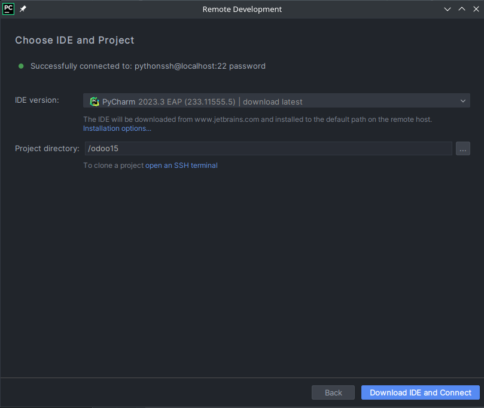
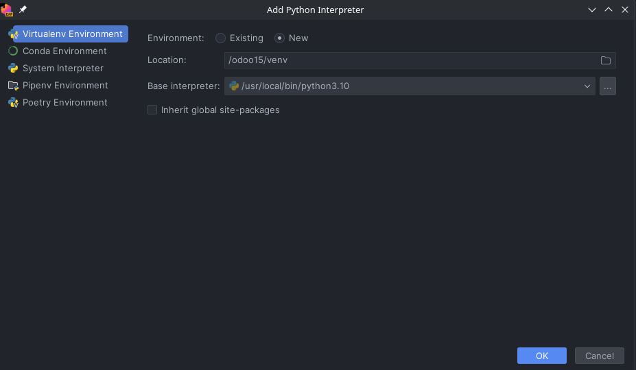
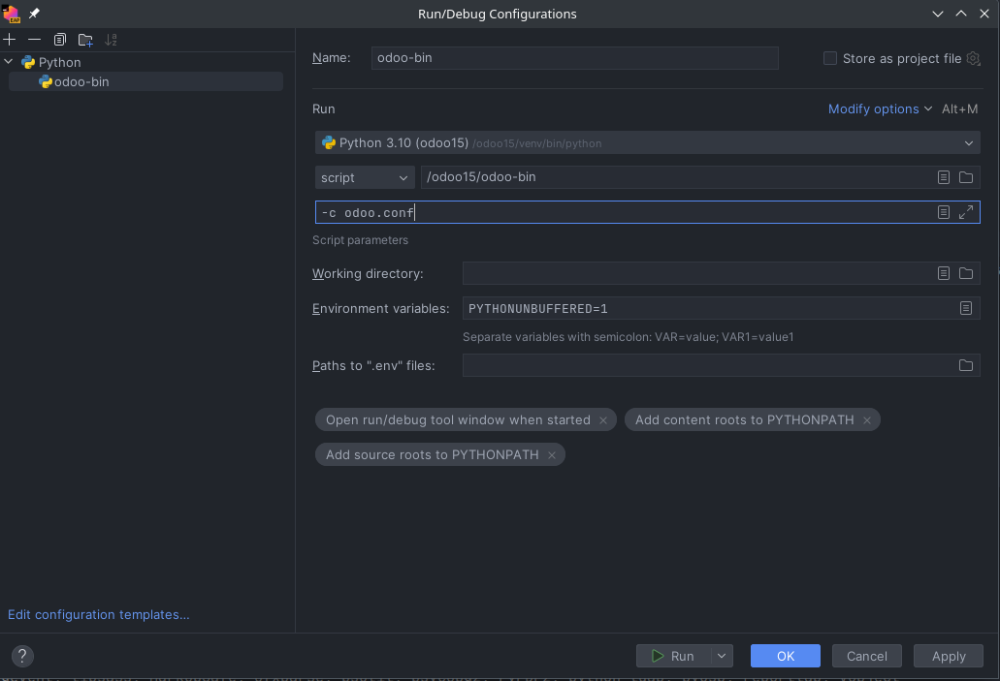

# odoo-docker-dev

Setup an odoo image with ssh and a postgres container with an odoo-custom-addons bind, for remote ssh development with
pycharm.

### 1. Run the docker compose file
    - docker-compose up -d in the project folder

### 2. Connect to the docker container using pycharm or gateway
    - file -> remote development -> ssh
    - select odoo15 as project directory:
  

### 3. Add a python interpreter

  

### 4. pip install -r requirements.txt  
### 5. Add a run configuration:
   
  

### 6. Hit the run button and connect to odoo on localhost at port 8069

